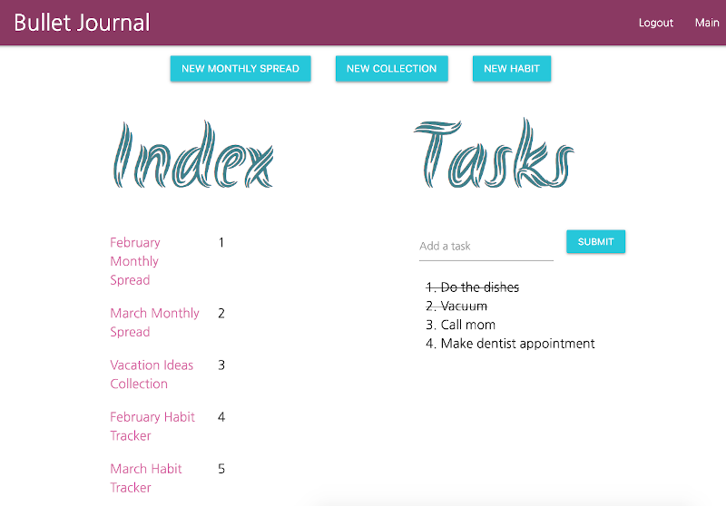

# Bullet Journal

## Description

An application that accepts user input into a bullet journal format to organize one's tasks.

The user creates an account with an email and password, then they are presented with the main screen of the app.

The user can then add tasks/goals to the different sections in the journal that are then saved onto an index page. The user can add tasks/goals by day or month and also add habits to a monthly habit tracker where they can keep daily track of habit completion.

## [Try it yourself!](https://personal-bullet-journal.herokuapp.com/)

If you don't want to sign up, use the following to log in: 
Username: test@test.com 
Password: test 

The following image shows a glimpse of the application:

## Getting Started

Application runs in browser, no installation or download needed.

## Built With

JavaScript - programmming language 
jQuery - JavaScript library 
Moment.js - JavaScript library 
Node.js - server environment 
Passport.js - authentication middleware 
Handlebars - templating language 
Sequelize - JavaScript library for SQL 
Adobe XD - UX/UI design program  
Materialize - CSS Framework 

## Authors

Brittany Fortner  
Dane Burns  
Dennis Amparo  
Kenneth Achumahara  

See commit history [here](https://github.com/bfeliz/bullet-journal/graphs/contributors).

## Planned Updates

Future updates would include having a personalized welcome page for the user, ability to upload picture events, reminders (doctor appointment, flight schedule, etc.), archive old monthly spreads/collections/habits, ability to handwrite, and ability to share website (referral).
